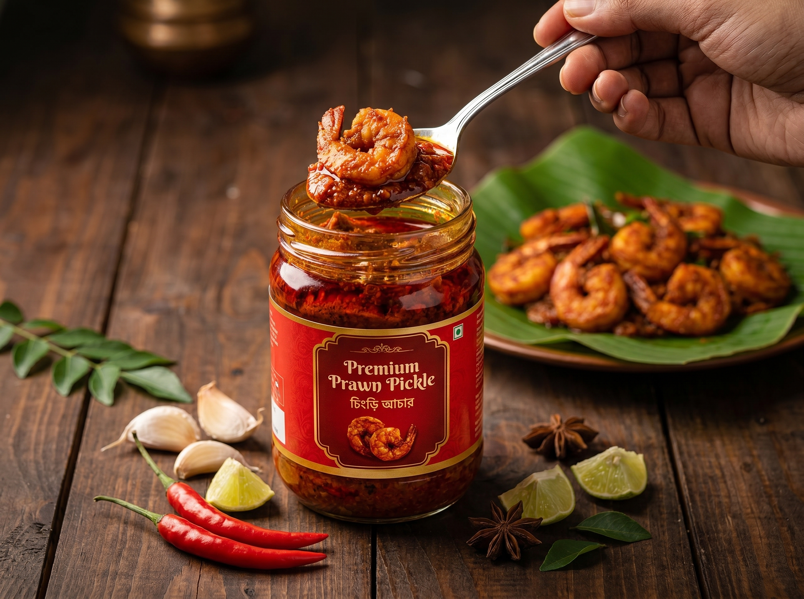

<!DOCTYPE html>
<html lang="bn" class="scroll-smooth">
<head>
    <meta charset="UTF-8">
    <meta name="viewport" content="width=device-width, initial-scale=1.0">
    <title>রাজকীয় চিংড়ি | প্রিমিয়াম চিংড়ি আচার</title>
    
    <!-- Google Fonts -->
    <link rel="preconnect" href="https://fonts.googleapis.com">
    <link rel="preconnect" href="https://fonts.gstatic.com" crossorigin>
    <link href="https://fonts.googleapis.com/css2?family=Hind+Siliguri:wght@300;400;500;600;700&family=Poppins:wght@300;400;500;600&display=swap" rel="stylesheet">
    
    <!-- Font Awesome -->
    <link rel="stylesheet" href="https://cdnjs.cloudflare.com/ajax/libs/font-awesome/6.4.0/css/all.min.css">

    <!-- Tailwind CSS -->
    

    <!-- Tailwind Configuration -->
    

    
</head>
<body class="text-dark antialiased selection:bg-primary selection:text-white">

    <!-- Preloader -->
    

        

            

            

            

                <i class="fa-solid fa-shrimp"></i>
            

        

        <h2 class="text-2xl font-bold text-dark tracking-wide bg-clip-text text-transparent bg-gradient-to-r from-primary to-gold">রাজকীয় চিংড়ি</h2>
        
স্বাদ লোডিং হচ্ছে...

    

    <!-- Sticky Navbar -->
    <nav class="fixed w-full top-0 z-50 glass shadow-glass transition-all duration-300 py-4" id="navbar">
        

            

                <!-- Logo -->
                <a href="#" class="flex items-center gap-3 group">
                    

                        <i class="fa-solid fa-shrimp text-lg"></i>
                    

                    রাজকীয়.
                </a>

                <!-- Desktop Menu -->
                

                    <a href="#home" class="font-medium hover:text-primary transition-colors relative after:absolute after:bottom-0 after:left-0 after:w-0 after:h-0.5 after:bg-primary hover:after:w-full after:transition-all after:duration-300">হোম</a>
                    <a href="#products" class="font-medium hover:text-primary transition-colors relative after:absolute after:bottom-0 after:left-0 after:w-0 after:h-0.5 after:bg-primary hover:after:w-full after:transition-all after:duration-300">আচার সমূহ</a>
                    <a href="#process" class="font-medium hover:text-primary transition-colors relative after:absolute after:bottom-0 after:left-0 after:w-0 after:h-0.5 after:bg-primary hover:after:w-full after:transition-all after:duration-300">প্রস্তুত প্রণালী</a>
                    <a href="#reviews" class="font-medium hover:text-primary transition-colors relative after:absolute after:bottom-0 after:left-0 after:w-0 after:h-0.5 after:bg-primary hover:after:w-full after:transition-all after:duration-300">মতামত</a>
                

                <!-- Icons (Cart & Mobile Menu) -->
                

                    <button onclick="toggleCart()" class="relative text-dark hover:text-primary transition-colors p-2 rounded-full hover:bg-primary/10">
                        <i class="fa-solid fa-shopping-bag text-xl"></i>
                        0
                    </button>
                    <button class="md:hidden text-dark text-2xl p-2" onclick="document.getElementById('mobile-menu').classList.toggle('hidden')">
                        <i class="fa-solid fa-bars"></i>
                    </button>
                

            

        

        <!-- Mobile Menu Panel -->
        

            

                <a href="#home" class="block py-2 text-lg font-medium hover:text-primary">হোম</a>
                <a href="#products" class="block py-2 text-lg font-medium hover:text-primary">আচার সমূহ</a>
                <a href="#process" class="block py-2 text-lg font-medium hover:text-primary">প্রস্তুত প্রণালী</a>
                <a href="#reviews" class="block py-2 text-lg font-medium hover:text-primary">মতামত</a>
            

        

    </nav>

    <!-- Hero Section -->
    <section id="home" class="relative pt-32 pb-20 lg:pt-48 lg:pb-32 overflow-hidden">
        <!-- Background decorative blobs -->
        

        

        

        

            

                <!-- Hero Text -->
                

                    

                        <i class="fa-solid fa-star text-sm"></i>
                        ১০০% অর্গানিক ও ঘরোয়া তৈরি
                    

                    <h1 class="text-5xl lg:text-7xl font-bold leading-tight mb-6 text-dark">
                        খাঁটি স্বাদের 
                        রাজকীয় চিংড়ি 
                        আচার
                    </h1>
                    

                        বাছাই করা তাজা চিংড়ি এবং নিজস্ব রেসিপিতে তৈরি খাঁটি মসলার এক অপূর্ব মিলন। প্রতি লোকমায় অনুভব করুন আভিজাত্য আর তৃপ্তি।
                    

                    

                        <a href="#products" class="px-8 py-4 bg-primary text-white font-semibold rounded-full shadow-luxury hover:shadow-glow hover:-translate-y-1 transition-all duration-300 flex items-center gap-2">
                            <i class="fa-solid fa-cart-shopping"></i> অর্ডার করুন
                        </a>
                        <a href="#process" class="px-8 py-4 bg-white text-dark border border-gray-200 font-semibold rounded-full hover:border-primary hover:text-primary shadow-sm hover:-translate-y-1 transition-all duration-300 flex items-center gap-2 group">
                            কীভাবে তৈরি <i class="fa-solid fa-arrow-right group-hover:translate-x-1 transition-transform"></i>
                        </a>
                    

                    
                    

                        
<i class="fa-solid fa-truck-fast text-primary text-lg"></i> সারা দেশে ডেলিভারি

                        
<i class="fa-solid fa-shield-halved text-primary text-lg"></i> ১০০% কোয়ালিটি গ্যারান্টি

                    

                

                <!-- Hero Image -->
                

                    <!-- Decorative circle behind image -->
                    

                    
                    <!-- Main floating image -->
                    

                        
                        
                        <!-- Floating Badge 1 -->
                        

                            

                                <i class="fa-solid fa-thumbs-up"></i>
                            

                            

                                
কাস্টমার রেটিং

                                
৪.৯/৫.০

                            

                        

                        <!-- Floating Badge 2 -->
                        

                            

                                <i class="fa-solid fa-fire"></i>
                            

                            

                                
বেস্ট সেলার

                                
স্পেশাল ঝাল

                            

                        

                    

                

            

        

    </section>

    <!-- Products Section -->
    <section id="products" class="py-24 bg-white relative">
        

            

                আমাদের আয়োজন
                <h2 class="text-4xl md:text-5xl font-bold text-dark mb-4">সবচেয়ে জনপ্রিয় আচার</h2>
                

            

            

                <!-- Products injected via JS, showing static placeholders for structure -->
            

        

    </section>

    <!-- Making Process -->
    <section id="process" class="py-24 bg-dark text-white relative overflow-hidden">
        <!-- Abstract BG patterns -->
        

        
        

            

                প্রস্তুত প্রণালী
                <h2 class="text-4xl md:text-5xl font-bold mb-4">যেভাবে তৈরি হয় আমাদের আচার</h2>
                
সম্পূর্ণ স্বাস্থ্যকর ও ঘরোয়া পরিবেশে প্রতিটি ধাপ নিপুণভাবে সম্পন্ন করা হয়।

            

            

                <!-- Connecting Line -->
                

                <!-- Step 1 -->
                

                    

                        <i class="fa-solid fa-water text-3xl text-primary group-hover:text-white transition-colors group-hover:rotate-12 duration-300"></i>
                        1
                    

                    <h3 class="text-xl font-bold mb-3">তাজা চিংড়ি সংগ্রহ</h3>
                    
সরাসরি নদী থেকে সংগৃহীত বাছাইকৃত তাজা চিংড়ি পরিষ্কার করা হয় নিখুঁতভাবে।

                

                <!-- Step 2 -->
                

                    

                        <i class="fa-solid fa-mortar-pestle text-3xl text-primary group-hover:text-white transition-colors group-hover:-rotate-12 duration-300"></i>
                        2
                    

                    <h3 class="text-xl font-bold mb-3">খাঁটি মসলার মিশ্রণ</h3>
                    
নিজস্ব ভাঙানো সরিষার তেল এবং বাছাই করা খাঁটি মসলার বিশেষ মিশ্রণ তৈরি করা হয়।

                

                <!-- Step 3 -->
                

                    

                        <i class="fa-solid fa-jar text-3xl text-primary group-hover:text-white transition-colors group-hover:scale-110 duration-300"></i>
                        3
                    

                    <h3 class="text-xl font-bold mb-3">রান্না ও সংরক্ষণ</h3>
                    
সঠিক তাপমাত্রায় রান্না করে জীবাণুমুক্ত কাঁচের বয়ামে দীর্ঘদিন ভালো থাকার জন্য সংরক্ষণ।

                

            

        

    </section>

    <!-- Reviews Section -->
    <section id="reviews" class="py-24 bg-light overflow-hidden">
        

            

                

                    গ্রাহকদের মতামত
                    <h2 class="text-4xl md:text-5xl font-bold text-dark mb-6 leading-tight">স্বাদ নিয়ে আমাদের গ্রাহকরা যা বলেন</h2>
                    
আমাদের শত শত সন্তুষ্ট গ্রাহকই আমাদের পণ্যের মানের সেরা প্রমাণ। আপনার মতামতের অপেক্ষায় আছি আমরাও।

                    
                    

                        

                            
                            
                            
                            
+5k

                        

                        

                            

                                <i class="fa-solid fa-star"></i><i class="fa-solid fa-star"></i><i class="fa-solid fa-star"></i><i class="fa-solid fa-star"></i><i class="fa-solid fa-star"></i>
                            

                            4.9/5.0 (৫০০০+ রিভিউ)
                        

                    

                

                <!-- Auto vertical scrolling reviews -->
                

                    <!-- Gradient Overlays for smooth fade -->
                    

                    

                    
                    

                        <!-- Duplicated list for seamless loop -->
                        
                    

                

            

        

    </section>

    <!-- FAQ Section -->
    <section class="py-24 bg-white">
        

            

                <h2 class="text-3xl md:text-4xl font-bold text-dark mb-4">সাধারণ জিজ্ঞাসা</h2>
                

            

            

                <!-- FAQs will be generated by JS -->
            

        

    </section>

    <!-- Footer -->
    <footer class="bg-dark pt-20 pb-10 text-white relative border-t-4 border-primary">
        

            

                <!-- Brand Info -->
                

                    <a href="#" class="flex items-center gap-3 group inline-flex">
                        

                            <i class="fa-solid fa-shrimp text-lg"></i>
                        

                        রাজকীয়.
                    </a>
                    
খাঁটি উপাদান ও নিজস্ব রেসিপিতে তৈরি বাংলাদেশের প্রিমিয়াম চিংড়ি আচার ব্র্যান্ড।

                    

                        <a href="#" class="w-10 h-10 rounded-full bg-gray-800 flex items-center justify-center hover:bg-primary transition-colors hover:-translate-y-1"><i class="fa-brands fa-facebook-f"></i></a>
                        <a href="#" class="w-10 h-10 rounded-full bg-gray-800 flex items-center justify-center hover:bg-primary transition-colors hover:-translate-y-1"><i class="fa-brands fa-instagram"></i></a>
                        <a href="#" class="w-10 h-10 rounded-full bg-gray-800 flex items-center justify-center hover:bg-primary transition-colors hover:-translate-y-1"><i class="fa-brands fa-youtube"></i></a>
                    

                

                <!-- Links -->
                

                    <h4 class="text-lg font-bold mb-6 text-white border-b border-gray-800 pb-2 inline-block">দ্রুত লিংক</h4>
                    <ul class="space-y-3 text-gray-400 text-sm">
                        <li><a href="#home" class="hover:text-primary transition-colors flex items-center gap-2"><i class="fa-solid fa-angle-right text-xs"></i> হোম</a></li>
                        <li><a href="#products" class="hover:text-primary transition-colors flex items-center gap-2"><i class="fa-solid fa-angle-right text-xs"></i> আমাদের পণ্য</a></li>
                        <li><a href="#process" class="hover:text-primary transition-colors flex items-center gap-2"><i class="fa-solid fa-angle-right text-xs"></i> প্রস্তুত প্রণালী</a></li>
                        <li><a href="#" class="hover:text-primary transition-colors flex items-center gap-2"><i class="fa-solid fa-angle-right text-xs"></i> শর্তাবলী</a></li>
                    </ul>
                

                <!-- Contact -->
                

                    <h4 class="text-lg font-bold mb-6 text-white border-b border-gray-800 pb-2 inline-block">যোগাযোগ</h4>
                    <ul class="space-y-4 text-gray-400 text-sm">
                        <li class="flex items-start gap-3">
                            <i class="fa-solid fa-location-dot mt-1 text-primary"></i>
                            ধানমন্ডি ২৭, ঢাকা, বাংলাদেশ
                        </li>
                        <li class="flex items-center gap-3">
                            <i class="fa-solid fa-phone text-primary"></i>
                            +880 1234 567890
                        </li>
                        <li class="flex items-center gap-3">
                            <i class="fa-solid fa-envelope text-primary"></i>
                            support@rajkio.com
                        </li>
                    </ul>
                

                <!-- Newsletter -->
                

                    <h4 class="text-lg font-bold mb-6 text-white border-b border-gray-800 pb-2 inline-block">অফার পেতে সাবস্ক্রাইব করুন</h4>
                    <form class="flex flex-col gap-3" onsubmit="event.preventDefault(); showToast('ধন্যবাদ! আপনি সফলভাবে সাবস্ক্রাইব করেছেন।');">
                        <input type="email" placeholder="আপনার ইমেইল ঠিকানা" class="px-4 py-3 bg-gray-800 border border-gray-700 rounded-xl focus:outline-none focus:border-primary text-sm w-full transition-colors text-white font-en" required>
                        <button type="submit" class="bg-primary hover:bg-primary-dark text-white font-semibold py-3 rounded-xl transition-colors w-full shadow-lg shadow-primary/20">সাবস্ক্রাইব</button>
                    </form>
                

            

            
            

                
&copy; 2026 রাজকীয় চিংড়ি. সর্বস্বত্ব সংরক্ষিত।

                

                    <i class="fa-brands fa-cc-visa text-2xl hover:text-white transition-colors"></i>
                    <i class="fa-brands fa-cc-mastercard text-2xl hover:text-white transition-colors"></i>
                    <i class="fa-brands fa-cc-amex text-2xl hover:text-white transition-colors"></i>
                

            

        

    </footer>

    <!-- Floating WhatsApp Button -->
    <a href="https://wa.me/1234567890" target="_blank" class="fixed bottom-6 left-6 z-40 bg-whatsapp text-white w-14 h-14 rounded-full flex items-center justify-center text-3xl shadow-[0_0_20px_rgba(37,211,102,0.5)] hover:scale-110 hover:shadow-[0_0_30px_rgba(37,211,102,0.8)] transition-all duration-300 animate-bounce cursor-pointer">
        <i class="fa-brands fa-whatsapp"></i>
    </a>

    <!-- Overlay for Cart -->
    

    <!-- Right Sidebar Cart -->
    

        <!-- Cart Header -->
        

            <h3 class="text-xl font-bold text-dark flex items-center gap-2">
                <i class="fa-solid fa-cart-shopping text-primary"></i> আপনার কার্ট
            </h3>
            <button onclick="toggleCart()" class="w-8 h-8 rounded-full bg-gray-200 hover:bg-red-100 hover:text-red-500 flex items-center justify-center transition-colors">
                <i class="fa-solid fa-xmark"></i>
            </button>
        

        <!-- Cart Items -->
        

            <!-- Items injected by JS -->
            

                <i class="fa-solid fa-basket-shopping text-6xl mb-4 opacity-20"></i>
                
কার্ট খালি আছে!

            

        

        <!-- Cart Footer -->
        

            

                সাবটোটাল
                ৳0
            

            

                ডেলিভারি চার্জ
                চেকআউটে হিসাব করা হবে
            

            <button onclick="checkout()" class="w-full bg-primary hover:bg-primary-dark text-white font-bold py-4 rounded-2xl transition-all shadow-luxury hover:-translate-y-1 flex justify-center items-center gap-2">
                চেকআউট করুন <i class="fa-solid fa-arrow-right"></i>
            </button>
        

    

    <!-- Toast Container -->
    

    <!-- Scripts -->
    
</body>
</html>

)

